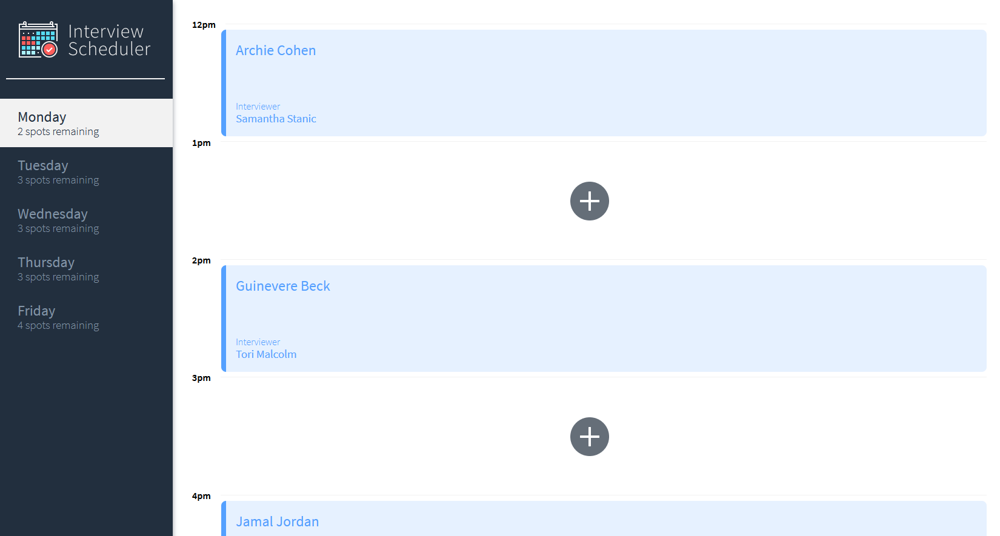
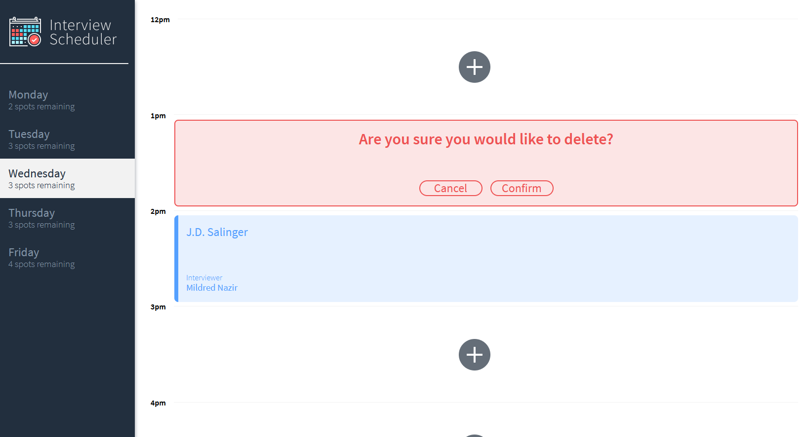

# Interview Scheduler

Interview Scheduler allows users to easily book interviews

## Setup

Install dependencies with `npm install`.

## Features
Users are able to:
* navigate through the days on the sidebar
* see remaining spots on any given day
* edit/delete interviews 
* confirm changes
* see error messages if there is a network issue

## Final Product





## Setup

Install dependencies with `npm install`.

## Running Webpack Development Server

```sh
npm start
```

## Running Jest Test Framework

```sh
npm test
```

## Running Storybook Visual Testbed

```sh
npm run storybook
```
